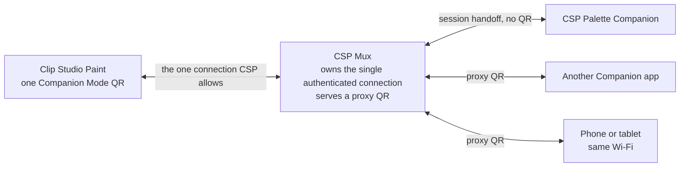

# CSP Mux

Clip Studio Paint shows one Companion Mode QR code and behaves as if it has
exactly one phone. Companion authentication rotates the password the QR handed
out, so a second tool scanning the same code invalidates what the first one holds:
connect the second and you break the first. There is no setting for this — one
connection is all CSP offers.

CSP Mux takes that one connection, holds it, and re-shares it: it scans CSP's QR
once, then shows a proxy QR that up to eight Companion apps can scan instead.



Each app gets its own authentication, its own rotated reconnect password, and its
own serial-number space. The Mux remaps all of them onto the one upstream
connection and returns every response to the client that asked for it.


## How to use it

1. In CSP, open **File > Connect to smartphone** (German: **Datei > Mit Smartphone
   verbinden...**) and leave the QR on screen. The menu item is a toggle with a
   checkmark — selecting it while Companion Mode is already on turns it off.
2. Run `CSP Mux.exe`.
3. Open **Settings** and choose a **Connection scope**. It cannot be changed while
   sharing is running.
4. Select **Scan CSP QR**. The Mux finds CSP's code on screen, connects, and
   authenticates.
5. Wait for the proxy QR. The status reads **Sharing**, and the pill beside it
   counts connected apps.
6. Let each app scan the proxy QR instead of CSP's.

CSP's own QR can be dismissed once the Mux says **Sharing**. Closing the window
hides it to the tray; exit from the tray icon, or turn tray mode off in Settings.

## Connection scope

| Scope | Reachable from | Cost |
|---|---|---|
| **This computer only · 127.0.0.1** (default) | apps on this PC | none |
| **A private IPv4 address** from the picker | that one network — a phone or tablet on the same Wi-Fi | a Windows Firewall prompt the first time |

The picker lists loopback plus every private IPv4 address on an interface that is
up. The proxy binds only the address you picked. It never binds all interfaces,
and the pairing encoder refuses to put a non-private address in a QR at all.

LAN mode relies on the normal user-approved Windows Firewall prompt. The app does
not create a firewall rule itself.

## Hiding the QR

**Hide QR** blurs the code in place rather than removing it. The frame keeps its
size, the proxy keeps running, and every connected app stays connected. **Show QR**
brings it back when another app needs to join. Settings can do the hide
automatically after the first app connects.

The blur radius is three times the module pitch of the code as rendered, not a
fixed number, so a denser payload cannot end up under-blurred. Verified by
decoding: the sharp render decodes, the blurred one does not.


## CSP Palette Companion

The Companion does not scan the proxy QR. While the Mux is sharing on loopback it
publishes a session handoff file, and the Companion connects with no QR on screen
at all.

```text
%LOCALAPPDATA%\CSP Suite\mux-session.json
```

Four fields, nothing else:

| Field | What it is |
|---|---|
| `schemaVersion` | `1`. A newer version is refused, not guessed at. |
| `pairingUrl` | the **proxy's** pairing URL: its loopback address, port, generation, and the proxy's own rotating invitation password |
| `processId` | the Mux process that owns the listener |
| `processStartTimeUtc` | start time of that process, so a recycled PID is rejected |

CSP's upstream credential is never written to this file and never leaves the Mux
process. The file carries a proxy credential only, and revoking it is a matter of
stopping sharing.

It is written with a protected DACL — owner and SYSTEM, inheritance off — because
`%LOCALAPPDATA%` carries an inherited Full-Control ACE for an AppContainer
capability SID, which would otherwise let a sandboxed process read a live
credential. The DACL is applied to a temp file that is then moved into place: a
create-then-re-ACL leaves an interval where the file is readable, and `File.Move`
within a volume preserves explicit ACEs instead of re-inheriting. A medium
integrity no-read-up label is set as well, best effort.

The file is written once per session, only in **This computer only** scope, and
deleted when sharing stops, when the Mux exits, and at the next start if the
process it names is gone. In LAN scope the Mux deletes it rather than publishing.

The Companion refuses it unless every check passes: schema matches, every
advertised address is loopback, the named process exists and is called `CSP Mux`,
its start time matches, and that process actually owns a listener on the
advertised port. Anything else falls back to the QR path.

Verified end to end today against real Clip Studio Paint: CSP to Mux to Companion,
a 12-colour palette extracted from the canvas through the proxy. The Mux read
**1 app**, the Companion read **Ready · through CSP Mux**.


## Why it needs a protocol broker

A transparent TCP tunnel does not work here.

- Companion authentication rotates the password the QR handed out.
- Each connection has its own serial numbers and pending responses.
- CSP sends unsolicited state pushes that expect replies.
- Reconnection uses a rotated password and a reconnect marker.
- Several clients can send conflicting state changes at once.

So the Mux terminates the protocol on both sides: upstream it is one smartphone
client, downstream it is a Companion Mode server. For every forwarded request it
stores `upstream serial -> session + downstream serial + command`, restores the
original serial on the way back, and drops the mapping on completion, disconnect,
or upstream reset. State pushes are acknowledged upstream promptly, cached, then
re-broadcast downstream with independent serials, and a newly connected app is
seeded from the cache.

| Command class | Policy |
|---|---|
| Read-only state and canvas reads | concurrent, four at a time |
| Colour, alpha, brush size, gestures, navigator, Quick Access, mode and tab changes | one ordered queue, shared by all clients |

Limits are 8 downstream clients, 4 concurrent reads, and 32 MB frames. The app
writes no log file, so QR payloads, passwords, and authentication frames never
reach disk.

## Download

Windows 10 or 11, 64-bit. Both files are the same app.

| Download | Size | You need |
|---|---|---|
| `CSP-Mux-<version>-win-x64-needs-dotnet8.exe` | 2.3 MB | the [.NET 8 Desktop Runtime](https://dotnet.microsoft.com/download/dotnet/8.0) |
| `CSP-Mux-<version>-win-x64-standalone.exe` | 68.7 MB | nothing |

Take the small one unless you would rather not install the runtime. Each release
also carries `SHA256SUMS.txt`.

## Antivirus

Both downloads are unsigned single-file bundles that unpack themselves at launch.
Heuristic scanners score that shape as suspicious, so either build can be flagged
even though nothing is wrong with it. The framework-dependent build trips it less
often — it is 2.3 MB of managed code rather than a bundled runtime.

Check the hash before anything else:

```powershell
Get-FileHash "CSP-Mux-1.0.0-win-x64-standalone.exe" -Algorithm SHA256
```

Compare it with the line for that filename in `SHA256SUMS.txt` on the release. If
it does not match, delete the file.

If it matches and the scanner still blocks it, add an exclusion for that one file:
**Windows Security > Virus & threat protection > Manage settings > Exclusions >
Add an exclusion > File**. Exclude the specific file, not its folder.

Building from source is two commands and produces the same app.

## Build and test

Prerequisite: .NET 8 SDK. The app is WPF, so it builds on Windows only. The
`CspMultiplexer.Protocol` and `CspMultiplexer.Broker` libraries and their tests
are plain `net8.0` and build anywhere.

```powershell
dotnet restore CspAppMultiplexer.sln
dotnet build CspAppMultiplexer.sln -c Release --no-restore
dotnet test CspAppMultiplexer.sln -c Release --no-build --no-restore
```

Run it without publishing:

```powershell
dotnet run --project src/CspMultiplexer.App/CspMultiplexer.App.csproj -c Release
```

Build the two release downloads exactly as CI builds them:

```powershell
./tools/publish-local.ps1 -Version 1.0.0
```

Trimming and NativeAOT are not options here. The app references Windows Forms for
the tray icon and ZXing, and `-p:PublishTrimmed=true` fails with `NETSDK1175`.

## Where this stands

A working proof of concept, verified end to end against real Clip Studio Paint
with CSP Palette Companion attached through the proxy.

What is covered by automated tests: two clients with colliding serials receiving
only their own responses, out-of-order upstream completion, broadcast pushes with
independent downstream serials, downstream reconnect with a rotated password,
locally terminated heartbeats, mutating commands queued across clients, private
LAN binding requiring explicit opt-in, and pairing/frame codec round trips.

What has not been proven:

- Compatibility with Companion clients other than CSP Palette Companion. That is
  the main gap.
- Controlled upstream reconnection after CSP restarts or drops the socket.
- Behaviour under load: rate limits, preview caching, and outstanding-command
  ceilings exist but have not been exercised.
- Per-client permissions. Every connected app currently has the same capabilities,
  including Quick Access.
- Tested against native Windows CSP PRO 4.0.10 with a German UI. Companion Mode is
  an unofficial, reverse-engineered integration and can break when CSP changes its
  private wire protocol.

## Third-party components

The Companion Mode protocol work follows the MIT-licensed
[`chocolatkey/clipremote`](https://github.com/chocolatkey/clipremote), which
implements the client side, not the multi-client server here. QR encoding and
decoding use ZXing.Net. See `THIRD-PARTY-NOTICES.md` in the source and in the
published output.

## License

Copyright (C) 2026 beasty.

This project is licensed under the [GNU General Public License v3.0](LICENSE).
