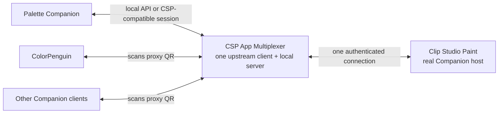

# CSP App Multiplexer

Status: working desktop/LAN proof of concept.

## What works now

The repository contains a Windows .NET 8 application that:

1. scans CSP's real Companion Mode QR code from the screen;
2. establishes and owns the single authenticated CSP connection;
3. starts a CSP-compatible server on loopback or an explicitly selected private
   LAN address;
4. displays a new proxy QR code;
5. accepts several independent apps using the same proxy invitation;
6. terminates downstream authentication and password rotation;
7. remaps each downstream serial space onto the single upstream connection;
8. forwards arbitrary Companion commands and binary preview tails; and
9. broadcasts CSP server pushes with independent downstream serials.

Mutating commands such as color, brush, navigator, gesture, and Quick Access
changes share one ordered queue. Read-only/state requests use bounded
concurrency so a large preview request does not unnecessarily block every app.

The automated integration fixture connects two clients that both use serial
`7`, deliberately completes their upstream calls out of order, and verifies
that each receives only its own response. Separate coverage exercises proxy QR
round trips, broadcast state pushes, and downstream reconnection.

This is not yet a production release. It still needs live compatibility
validation against ColorPenguin plus CSP Palette Companion, controlled
upstream reconnection, rate limits, and a permission model for dangerous
commands.

## Run the proof of concept

Prerequisites: Windows 10 or newer, .NET 8 SDK, and Clip Studio Paint running in
Studio Mode.

```powershell
dotnet run --project src/CspMultiplexer.App/CspMultiplexer.App.csproj -c Release
```

Then:

1. In CSP, open **File > Connect to smartphone** and keep the real QR visible.
2. Open **Settings** and choose **This computer only** or a private IPv4
   network under **Connection scope**.
3. In the multiplexer, select **Scan CSP QR**.
4. Wait for the proxy QR to appear.
5. Let ColorPenguin, CSP Palette Companion, a phone on the same Wi-Fi, or each
   other Companion app scan the proxy QR instead of CSP's real QR.

The compact **CSP Mux** window is centered on the proxy QR and live connection
LED. Use **Hide QR** after pairing without disconnecting CSP or any app, then
use **Show QR** when another app needs to join. Settings can optionally hide the
QR automatically after the first app connects.

Loopback remains the default. LAN mode binds only the private address selected
in the UI; it never binds all interfaces or advertises a public address. Windows
may show a Firewall permission prompt the first time LAN mode is used.

Build and test everything with:

```powershell
dotnet restore CspAppMultiplexer.sln
dotnet build CspAppMultiplexer.sln -c Release --no-restore
dotnet test CspAppMultiplexer.sln -c Release --no-build --no-restore
```

## Purpose

CSP App Multiplexer would let several local tools share one authenticated
Clip Studio Paint Companion Mode connection.

Clip Studio Paint currently presents one Companion Mode QR code and behaves
like a single remote-control host. Tools such as CSP Palette Companion and
ColorPenguin each want to act as the smartphone-side client. Connecting one can
therefore prevent another from connecting or invalidate the credentials that
the other tool scanned.

The multiplexer would become the only client connected directly to CSP. It
would then expose controlled downstream sessions to other applications.

## Central idea

The multiplexer would:

1. Scan CSP's real Companion Mode QR code.
2. Connect and authenticate to CSP once.
3. Start a local CSP-compatible server.
4. Generate and display a new proxy QR code.
5. Let ColorPenguin or another unmodified Companion client scan the proxy QR.
6. Authenticate each downstream app locally.
7. forward supported commands through the single upstream CSP connection.
8. Return responses and synchronized state to the correct downstream app.

The proxy QR would be shown by the multiplexer. It would not be injected into
or painted over Clip Studio Paint.



## Why this requires a protocol broker

A transparent TCP tunnel is not sufficient for multiple applications.

- Companion authentication rotates the password supplied by the QR code.
- Each connection has its own command serial numbers and pending responses.
- CSP sends unsolicited state synchronization commands that require replies.
- Several clients can send conflicting state-changing commands at the same
  time.
- Reconnection authentication uses a rotated password and a special reconnect
  marker.

The multiplexer must therefore terminate the protocol on both sides:

- Upstream, it behaves like one smartphone client connected to CSP.
- Downstream, it behaves like a CSP Companion Mode server for each app.

## QR format

The reverse-engineered client expects a URL shaped like:

```text
https://companion.clip-studio.com/rc/en-us?s=<encoded-connection-data>
```

The decoded `s` payload contains four tab-separated fields:

```text
ip-address-list    port    password    generation
```

The payload is reversibly obfuscated and hex encoded. The multiplexer needs an
encoder that is the inverse of the existing decoder.

For local desktop applications, the proxy QR should advertise `127.0.0.1` by
default. A separate, explicit **Allow devices on this network** setting could
advertise selected LAN addresses for phones or tablets.

The proxy must generate its own random invitation password. It must never put
CSP's real password in the downstream QR.

## Proposed components

### 1. Upstream CSP client

Owns the real QR pairing and the single connection to Clip Studio Paint.

Responsibilities:

- Pair and authenticate.
- Rotate and securely retain the upstream reconnect password.
- Send heartbeats.
- Reconnect when CSP drops the socket.
- Expose typed methods for the 24 known Companion commands.
- Receive and acknowledge CSP state pushes.
- Publish normalized state events to the broker.

The existing CSP Palette Companion protocol implementation informed this
component, but this project owns clean reusable libraries rather than depending
on the palette UI.

### 2. Downstream Companion server

Listens for unmodified apps that scanned the proxy QR.

Responsibilities:

- Parse CSP protocol frames.
- Implement `Authenticate` and `TellHeartbeat`.
- Validate the proxy generation and invitation password.
- Accept a different rotated reconnect password from each downstream client.
- Keep downstream credentials isolated per session.
- Return a CSP-compatible authentication result, protocol version, and Quick
  Access availability flag.
- Enforce frame-size, connection-count, and command-rate limits.

The shared invitation password may admit several new clients. Each successful
authentication creates a session with its own rotated reconnect password.
Reconnect requests can be matched by that unique password.

### 3. Serial and response router

Every downstream connection has its own serial-number space. The upstream CSP
connection has another.

For each forwarded request, the router stores:

```text
upstream serial -> downstream session + downstream serial + command
```

When CSP replies, the router restores the downstream serial and returns the
response only to the originating client.

Mappings must have timeouts and must be removed on completion, disconnect, or
upstream reset.

### 4. State synchronization hub

CSP can push color, settings, Quick Access, gesture-pad, sub-view, and shutdown
state.

The multiplexer should acknowledge an upstream push promptly after validating
and caching it. It should not block CSP while waiting for every downstream
client.

It can then:

- update its authoritative state cache;
- create new downstream push serials;
- broadcast the state to interested sessions;
- track downstream acknowledgements independently;
- seed a newly connected app from the cached state.

### 5. Command scheduler

Multiple clients can technically issue commands at once, but some operations
conflict.

Suggested policy:

| Command class | Initial policy |
|---|---|
| Read-only state queries | Concurrent |
| Preview/canvas reads | Bounded concurrency and optional caching |
| Current color, opacity, brush size | Serialized; last accepted command wins |
| Quick Access / Auto Actions | Exclusive and explicitly permitted |
| Gestures and navigator streams | Short per-client interaction lease |
| Mode/tab changes | Serialized |

The UI should show which client most recently changed shared state.

Later versions could offer per-client permissions such as **Color only**,
**Read canvas**, **Run Quick Access**, and **Full control**.

## ColorPenguin-first proof of concept

Static inspection of the available ColorPenguin build suggests that its CSP
integration primarily needs current-color synchronization and
`SetCurrentColor`. Its QR discovery appears to be used to locate and decode the
connection details; the actual control path is the Companion TCP protocol.
This must be confirmed with a live packet trace.

The smallest useful proof of concept is:

1. Connect the multiplexer upstream to CSP.
2. Start a loopback-only downstream server.
3. Display a CSP-compatible proxy QR.
4. Implement downstream authentication and heartbeat.
5. Implement or synthesize the color/settings state needed during startup.
6. Forward `SetCurrentColor`.
7. Forward relevant color-state pushes.
8. Connect ColorPenguin and CSP Palette Companion simultaneously.
9. Confirm that both can change/read color without disconnecting each other.

This avoids implementing image preview, gestures, Quick Access, and every
smartphone UI feature before the core idea has been proven.

## Native API for cooperating apps

Apps we control should not need to impersonate smartphone clients. The
multiplexer should also expose a small local API:

- named pipe on Windows by default;
- optional loopback HTTP/WebSocket API;
- capability negotiation;
- subscribe to state changes;
- set current color;
- read canvas;
- enumerate/invoke permitted Quick Access commands;
- health and connection status.

This API avoids QR scanning, duplicated authentication, and protocol emulation
for CSP Palette Companion. The CSP-compatible downstream server exists for
unmodified third-party apps such as ColorPenguin.

## Security model

Defaults must be conservative:

- Bind the downstream CSP-compatible server to loopback only.
- Require explicit opt-in before binding to a LAN address.
- Never bind to all interfaces implicitly.
- Never advertise or accept a public/non-LAN address.
- Generate cryptographically random invitation and reconnect passwords.
- Never log QR payloads, real CSP passwords, rotated passwords, or raw
  authentication frames.
- Redact sensitive fields from diagnostics and exported support bundles.
- Limit downstream clients, frame sizes, request rates, preview sizes, and
  outstanding commands.
- Treat Quick Access and Auto Action execution as a separate dangerous
  capability.
- Show every connected client and provide a disconnect/revoke control.
- Rotate the proxy generation and invitation password when sharing is stopped.

LAN mode may require a Windows Firewall rule. The application relies on the
normal user-approved Windows Firewall prompt and does not silently create a
rule.

## Failure behavior

- If CSP disconnects, fail pending downstream requests promptly.
- Notify downstream sessions that the host is unavailable.
- Attempt one controlled upstream reconnect using the rotated password.
- Do not silently replay state-changing commands after an uncertain failure.
- After upstream reconnection, refresh authoritative state before accepting
  new mutations.
- If one downstream client misbehaves, disconnect only that client.
- If serial or command validation fails, return a protocol error instead of
  forwarding malformed data.

## Observability

Provide structured, redacted diagnostics:

- upstream connected/authenticated/reconnecting;
- downstream client count and capability profile;
- command name, source client, latency, and outcome;
- serial-routing table size, without payload secrets;
- state-cache version;
- preview bandwidth and cache hit rate;
- dropped/rate-limited requests.

Raw authentication details must never be logged.

## Suggested repository structure

```text
csp-app-multiplexer/
  README.md
  docs/
    protocol-broker.md
    security.md
    testing.md
  src/
    CspMultiplexer.Protocol/
    CspMultiplexer.Upstream/
    CspMultiplexer.Downstream/
    CspMultiplexer.Broker/
    CspMultiplexer.LocalApi/
    CspMultiplexer.App/
  tests/
    CspMultiplexer.Protocol.Tests/
    CspMultiplexer.Broker.Tests/
    CspMultiplexer.IntegrationTests/
    CspMultiplexer.CompatibilityTests/
  tools/
    MockCspHost/
    MockCompanionClient/
```

.NET 8 is a practical first implementation because the existing palette
companion code is C#, the target platform is Windows, and shared protocol tests
can be reused. The protocol and broker libraries should remain UI-independent.

## Implementation stages

### Stage 0: protocol fixtures

- Move or replicate framing, crypto, QR decoding, and typed command schemas
  into UI-independent libraries.
- Add QR encoding round-trip tests.
- Build mock CSP host and mock smartphone client fixtures.

### Stage 1: one downstream ColorPenguin session

- Loopback listener.
- Proxy QR generation.
- Authenticate, heartbeat, and color state.
- Forward `SetCurrentColor`.
- Live compatibility test with ColorPenguin.

### Stage 2: real multiplexing

- Several downstream sessions.
- Serial remapping.
- Independent reconnect passwords.
- State-cache broadcast.
- Command scheduler.

### Stage 3: native local API

- Named-pipe API for CSP Palette Companion.
- Client capability grants.
- Connection/status UI.
- Remove QR scanning from cooperating apps.

### Stage 4: broader protocol support

- Quick Access.
- Canvas preview and caching.
- Navigator and gesture streams.
- More complete LAN/mobile compatibility coverage.

### Stage 5: hardening

- Fuzz frame parsing.
- Load and reconnection tests.
- Security review.
- Compatibility matrix across CSP versions and clients.

## Test plan

Automated tests should cover:

- QR encode/decode round trips.
- Authentication success, mismatch, generation mismatch, and reconnect.
- Two clients using the same invitation QR and receiving independent rotated
  passwords.
- Serial collisions between downstream clients.
- Out-of-order upstream responses.
- Client disconnect during an outstanding command.
- Upstream disconnect during a mutation.
- Broadcast pushes and downstream acknowledgement loss.
- Rate limits and oversized/malformed frames.
- Quick Access permission denial.
- Preview concurrency and cache correctness.
- Redaction of credentials in all logs.

Live tests should cover:

- CSP Palette Companion plus ColorPenguin connected simultaneously.
- A ColorPenguin-generated color reaching CSP through the proxy.
- A palette-companion color update reaching CSP without breaking
  ColorPenguin.
- CSP restart and controlled reconnection.
- Revoking one downstream client without disrupting the others.

All live tests that can alter artwork or invoke Quick Access must use a
disposable CSP document.

## Open questions

1. Which startup state pushes does ColorPenguin require before it considers the
   connection usable?
2. Does ColorPenguin accept loopback addresses from a QR displayed in another
   app, or does its scanner restrict the source window?
3. Does it require exact CSP timing or tolerate cached/synthesized state?
4. How should ownership work while two clients stream gestures?
5. Should preview requests be shared and cached across clients?
6. Which CSP versions change schemas or authentication behavior?
7. Can the local native API become the default while compatibility QR mode is
   clearly marked experimental?

## References

- [chocolatkey/clipremote](https://github.com/chocolatkey/clipremote) — MIT
  reverse-engineered smartphone-side client and command schemas.
- [Clip Studio Paint Companion Mode](https://help.clip-studio.com/en-us/manual_en/840_options/Companion_Mode.htm)

The project must retain applicable third-party notices and independently test
server-side behavior; `clipremote` implements the client side, not the
multi-client server described here.

## License

Copyright (C) 2026 beasty.

This project is licensed under the [GNU General Public License v3.0](LICENSE).
