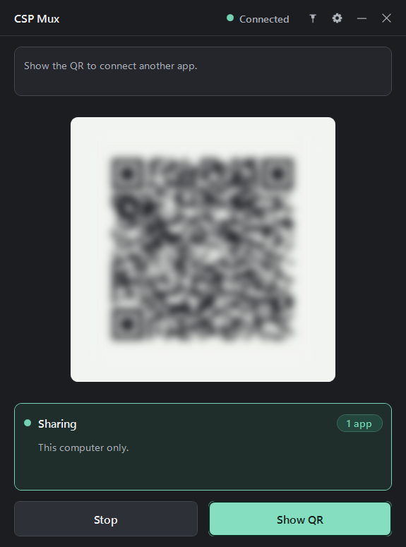

# CSP Mux

Clip Studio Paint allows one Companion Mode connection. CSP Mux holds that one
connection and re-shares it, so several tools can use CSP at the same time. Pair
once instead of re-pairing every time you switch tools.

## Use it

1. In CSP: **File > Connect to smartphone** (*Datei > Mit Smartphone verbinden*). Keep the real QR on screen.
2. Open the Mux. Under Settings > Connection scope pick **This computer only** or a private IPv4 address.
3. Select **Scan CSP QR**, wait for the proxy QR.
4. Point every Companion app at the **proxy** QR, never at CSP's.

**Connect to smartphone** is a toggle with a checkmark, not a dialog. Selecting
it while it is on turns Companion Mode off.

The client pill counts attached apps. **Hide QR** blanks the code without
dropping CSP or any connected app.

## Pages

- [Installation](Installation) — downloads, .NET 8 runtime, antivirus
- [How It Works](How-It-Works) — one upstream, many downstream sessions
- [Connection Scope](Connection-Scope) — loopback vs LAN, security posture
- [Palette Companion Integration](Palette-Companion-Integration) — auto-connect handoff
- [Build from source](Build-from-Source) — SDK, publish flags, CI

Window 460 x 620. Lives in the tray; the close button hides it, **Exit** is in
the tray menu. Settings live in
`%LOCALAPPDATA%\CSP App Multiplexer\settings.json`.

Proof of concept: no upstream reconnection, no rate limits, no permission model
for dangerous commands. GPL-3.0.
